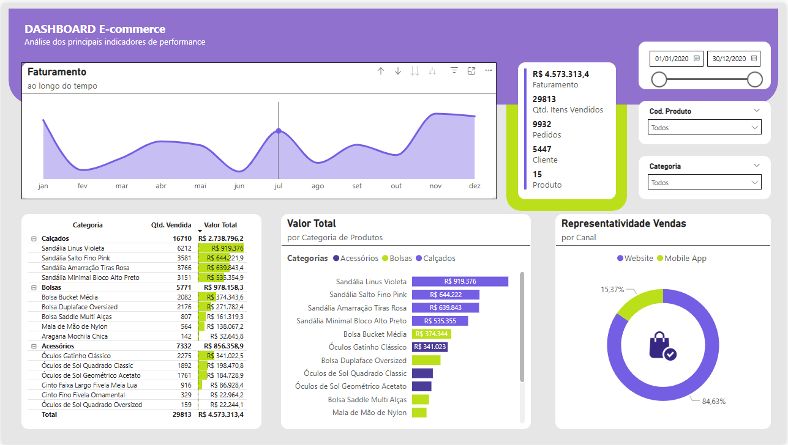

# Dashboard E-commerce – Performance de Vendas

Este projeto apresenta um **Dashboard de E-commerce** desenvolvido em **Power BI**, com base em dados de vendas de 2020.  
O objetivo é analisar os principais indicadores de performance, identificar tendências de faturamento e comparar categorias de produtos.

---

## Objetivos do Projeto
- Conectar e tratar dados de vendas a partir de uma planilha Excel.
- Realizar modelagem e relacionamento entre tabelas no Power BI.
- Criar medidas e métricas relevantes para análise.
- Estruturar um dashboard claro, bonito e profissional.
- Aplicar boas práticas de design e hierarquia visual.

---

## 📂 Estrutura do Repositório

📂 ecommerce-sales-dashboard

┣ 📂 data

┃ ┗ vendas_ecommerce.xlsx            # base de dados usada

┣ 📂 dashboard

┃ ┗ dashboard_ecommerce.pbix         # arquivo do Power BI

┗ 📂 images

┗ dashboard_preview.png           # print do dashboard

---

## Principais Insights
- **Faturamento total:** R$ 4,57 milhões em 2020.  
- **Categoria líder:** Calçados, com R$ 2,73 milhões em vendas.  
- **Produto destaque:** Sandália Linus Violeta, responsável por quase R$ 920 mil.  
- **Canal de vendas:** Website domina com 84,6% das vendas, enquanto o app representa 15,4%.  
- **Clientes e pedidos:** 9.932 pedidos realizados por 5.447 clientes.

---

## Tecnologias Utilizadas
- **Power BI Desktop**
- **Excel (base de dados)**
- **Power Query** para tratamento de dados
- **DAX** para criação de medidas

---

## Preview

---

## Como visualizar
1. Baixe o arquivo `dashboard_ecommerce.pbix`.
2. Abra no **Power BI Desktop** (gratuito).
3. Explore os filtros de data, produto e categoria para diferentes análises.

---

## Projeto desenvolvido como prática de análise de dados em **Power BI**.  

